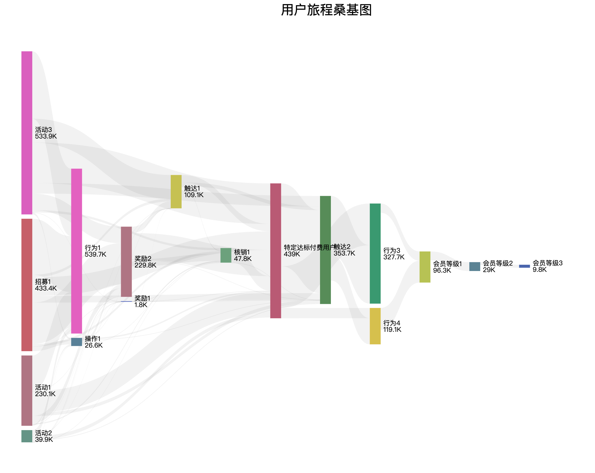

# CustomerJourneyData: 全链路用户旅程分析项目

## 项目概述

CustomerJourneyData 项目是一个端到端的用户旅程分析解决方案，从数据库集成开始，通过数据清洗、转换、分析到可视化展示，全面追踪和分析用户在不同渠道、触点的转化路径。项目通过打通多个业务系统数据，建立统一的用户视图，为企业提供数据驱动的决策支持。



## 数据处理流程

### 1. 数据集成与清洗
- **基础数据初始化**
  - 用户基础信息整合
  - 注册行为分析
  - 系统数据对齐

- **业务数据接入**
  - 营销活动数据
  - 线下活动数据
  - 会员活动记录
  - 用户行为数据
  - 应用使用数据

- **路径分析处理**
  - 用户行为路径识别
  - 注册渠道对齐
  - 统计指标计算

### 2. 分析成果

#### 用户获取与分布
- 总获客规模：1.2M+
- 四大主要获客渠道：
  - 渠道A（533.9K，44.5%）
  - 渠道B（433.4K，36.1%）
  - 渠道C（230.1K，19.2%）
  - 渠道D（40K，0.2%）

#### 关键转化指标
- **初始互动**：539.7K用户完成首次行为
- **目标付费用户**：439K，整体转化率36.6%
- **会员等级分布**：
  - 普通会员：96.3K
  - 高级会员：29K
  - 特权会员：9.8K

#### 核心路径转化率
- 渠道A → 目标付费用户：24.9%
- 活动A → 目标付费用户：37.3%
- 普通会员 → 高级会员：30.2%
- 高级会员 → 特权会员：33.7%

## 项目结构

```
CustomerJourneyData/
├── sql/                          # SQL查询和数据处理
│   ├── 00_main.sql              # 主处理流程
│   ├── 01_init_base_users.sql   # 用户基础数据
│   ├── 02_user_registration.sql # 注册行为分析
│   ├── 03_marketing_activities.sql # 营销活动
│   ├── 04_offline_activities.sql  # 线下活动
│   ├── 05_member_activities.sql   # 会员活动
│   ├── 06_user_behavior.sql     # 用户行为
│   ├── 07_app_behavior.sql      # 应用行为
│   ├── 08_roadmap_analysis.sql  # 路径分析
│   ├── 09_registration_alignment.sql # 注册对齐
│   └── 10_statistics.sql        # 统计分析
├── data.json                     # 节点数据
├── link.json                     # 关系数据
├── sankey.html                   # 桑基图可视化
└── consumer_analysis_2023.md     # 详细分析报告
```

## 主要功能

1. **数据集成与清洗**
   - 多源数据整合
   - 用户行为对齐
   - 数据标准化处理
   - 数据质量保证

2. **路径分析**
   - 用户行为序列提取
   - 转化路径识别
   - 漏斗分析
   - 路径优化建议

3. **可视化分析**
   - 交互式桑基图
   - 节点流转关系
   - 数值大小映射
   - 路径重要性展示

4. **报告生成**
   - 自动化数据统计
   - 关键指标提取
   - 可视化图表生成
   - 分析洞察总结

## 使用方法

1. **数据处理**
   ```bash
   # 执行数据处理脚本
   cd sql
   sqlcmd -i 00_main.sql
   ```

2. **数据准备**
   ```json
   // data.json 示例
   {
     "data": [
       {"name": "节点名", "depth": 1, "value": 1000}
     ]
   }
   ```

3. **可视化展示**
   ```bash
   # 启动本地服务器
   python3 -m http.server 8000
   # 访问 http://localhost:8000/sankey.html
   ```

## 关键发现与建议

### 优势
1. 数据打通全面，覆盖用户全生命周期
2. 获客渠道多元化，总体规模可观
3. 目标付费用户转化率达36.6%
4. 会员升级路径清晰，转化率稳定

### 改进方向
1. 优化渠道D获客效率
2. 提升活动参与度
3. 加强高等级会员占比
4. 完善数据质量监控

## 后续计划

1. **数据优化**
   - 扩展数据源接入
   - 提升数据处理效率
   - 增强数据质量监控

2. **获客优化**
   - 渠道效率均衡化
   - 获客成本优化
   - 渠道策略优化

3. **转化提升**
   - 活动机制改进
   - 触达精准度提升
   - 个性化策略优化

4. **会员发展**
   - 完善升级路径
   - 强化会员权益
   - 提升留存率

