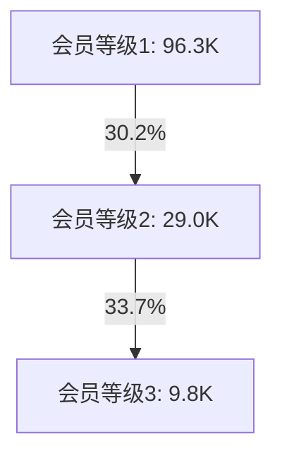

# 2023年消费者旅程分析报告

## 摘要

基于用户行为数据分析，2023年通过四个主要渠道获取了123.7万用户，经过多个转化环节后形成43.9万付费用户，最终沉淀出9.8万高价值会员用户。从数据表现来看，获客渠道呈现明显的集中化趋势，转化路径存在显著的效率差异，会员体系也面临发展瓶颈。本报告通过数据分析，展现用户在获取、转化、会员发展等环节的具体表现，并提供相应的优化建议。

## 一、用户获取分析

### 1.1 渠道获客情况

| 渠道名称 | 获客量(K) | 占比 |
|---------|-----------|------|
| 活动3   | 533.9     | 43.1% |
| 招募1   | 433.4     | 35.0% |
| 活动1   | 230.1     | 18.6% |
| 活动2   | 40.0      | 3.3%  |

**总获客量**：1,237.4K

**渠道分布分析**：
数据显示，活动3和招募1两个渠道的获客量合计达到967.3K，占总获客量的78.1%，呈现出明显的渠道集中特征。其中活动3以533.9K的获客量独占43.1%的份额，成为最主要的获客渠道。相比之下，活动2的获客量仅为40.0K，占比3.3%，获客能力相对较弱。这种渠道分布结构反映出当前获客策略过度依赖主要渠道，渠道多元化程度不足，可能存在获客风险。

### 1.2 用户初始行为分布

| 行为类型 | 用户数(K) | 占总用户比例 |
|---------|-----------|------------|
| 行为1   | 539.7     | 43.6%      |
| 操作1   | 26.6      | 2.1%       |

**行为分布分析**：
在用户初始行为方面，行为1是最主要的用户交互方式，覆盖539.7K用户，占总用户的43.6%。而操作1仅覆盖26.6K用户，占比2.1%。这种显著的行为分布差异表明，用户倾向于通过行为1进行首次互动，而操作1的触达范围和影响力相对有限，需要评估其作为用户触点的必要性和优化空间。

## 二、用户转化路径分析

### 2.1 用户旅程概览

> 注：通过桑基图可视化展示用户在不同阶段的流转情况，数据单位为K（千）。

### 2.2 关键节点转化

#### 奖励参与情况
**数据表现**：
- 奖励2：229.8K用户参与
- 奖励1：1.8K用户参与

**分析解读**：
奖励机制的参与度呈现显著的两极分化。奖励2获得了229.8K用户的参与，展现出较强的用户吸引力；而奖励1的参与用户仅有1.8K，参与度严重不足。两种奖励机制的参与差异高达127倍，表明奖励1在设计或执行层面可能存在重大问题，需要进行深入评估和优化。

#### 触达转化情况
**数据表现**：
- 触达1覆盖：109.1K用户
- 核销1完成：47.8K用户
- 触达2覆盖：353.7K用户

**分析解读**：
触达环节呈现出明显的层级差异。触达2的覆盖面最广，达到353.7K用户，是触达1（109.1K）的3.2倍。核销1环节实现了47.8K用户的转化，相对触达1的转化率为43.8%，表明在触达到核销的转化过程中存在较大的用户流失。这一数据反映出触达策略的效果存在优化空间，特别是在提升触达1的覆盖面和核销环节的转化效率方面。

#### 付费转化情况
**数据表现**：
- 特定达标付费用户：439.0K
- 主要来源转化率：
  - 活动3 → 付费用户：132.9K (转化率24.9%)
  - 招募1 → 付费用户：60.8K (转化率14.0%)
  - 奖励2 → 付费用户：85.7K (转化率37.3%)

**分析解读**：
付费转化环节展现出不同来源的效率差异。奖励2虽然参与用户基数较小，但实现了37.3%的最高转化率，说明其激励机制较为有效。活动3作为最大获客渠道，实现了24.9%的转化率，而招募1的转化率仅为14.0%。这种转化效率的差异表明，不同渠道的用户质量和转化路径存在明显差异，需要针对性地优化各个渠道的转化策略。

### 2.3 会员发展路径

**会员层级分析**：
会员体系呈现金字塔结构，具体表现为：
- 会员等级1：96.3K用户，构成会员体系的基础层
- 会员等级2：29.0K用户，从等级1实现30.2%的升级转化
- 会员等级3：9.8K用户，从等级2实现33.7%的升级转化

**深度解读**：
会员发展路径数据反映出典型的递减分布特征。从等级1到等级2的转化率为30.2%，等级2到等级3的转化率略有提升至33.7%，表明高等级会员的稳定性相对较好。然而，最高等级（等级3）的会员仅占总会员的7.2%，反映出会员体系在价值提升方面存在较大空间。这种分布结构说明当前会员体系在促进用户升级方面的效果有限，需要优化会员权益设计和升级路径。

## 三、核心问题分析

### 3.1 渠道效率差异

**数据现状**：
1. 渠道集中度过高
   - 活动3和招募1的获客量合计967.3K，占总获客量的78.1%
   - 活动2获客量仅40.0K，占比3.3%
   - 四个渠道的获客量差异达到13.3倍（最高533.9K vs 最低40.0K）

2. 转化效率不均衡
   - 活动3转化率24.9%，在大体量渠道中表现最佳
   - 招募1转化率14.0%，未能充分发挥第二大渠道的价值
   - 奖励2转化率37.3%，展现出较好的精准转化能力

**问题分析**：
当前的渠道结构存在明显的依赖风险，过度集中于活动3和招募1可能导致获客策略的脆弱性。同时，各渠道的转化效率差异较大，表明渠道运营水平和用户质量存在显著差异。这种不均衡的状态既影响了整体的获客效率，也增加了运营风险。

### 3.2 会员发展瓶颈

**数据现状**：
1. 会员等级分布
   - 会员等级1：96.3K用户，占会员总数71.2%
   - 会员等级2：29.0K用户，占会员总数21.5%
   - 会员等级3：9.8K用户，占会员总数7.2%

2. 升级转化效果
   - 等级1到等级2：30.2%的转化率
   - 等级2到等级3：33.7%的转化率
   - 整体呈现稳中略升的转化趋势

**问题分析**：
会员体系展现出较为典型的金字塔结构，但各层级之间的转化率普遍偏低，特别是高等级会员占比仅为7.2%，表明会员价值提升存在明显瓶颈。虽然等级2到等级3的转化率略高于前一级，但考虑到基数较小，实际的会员价值提升效果有限。这种状况反映出当前会员体系在促进用户价值提升方面的机制可能存在设计或执行层面的问题。

## 四、改进建议

### 4.1 短期优化方向

1. **渠道优化**
   - 分析活动3的高转化原因，复制成功经验
   - 评估活动2的获客策略，提升获客效率

2. **转化提升**
   - 扩大奖励2的覆盖范围
   - 优化奖励1的参与机制

3. **会员发展**
   - 分析会员升级路径中的关键节点
   - 优化会员等级2到等级3的升级转化

### 4.2 长期发展建议

1. **渠道发展**
   - 平衡渠道结构，降低对单一渠道依赖
   - 提升小渠道的获客能力

2. **会员体系**
   - 完善会员等级晋升机制
   - 提高高等级会员占比

## 五、附录

### 5.1 数据说明
- 数据周期：2023年度
- 数据来源：用户行为数据库
- 统计口径：
  - 获客数：各渠道获取的去重用户数
  - 转化率：目标用户数/源用户数 * 100%

### 5.2 主要指标定义
- 渠道获客量：各渠道获取的独立用户数
- 转化率：下一环节用户数/当前环节用户数 * 100%
- 会员升级率：高一级会员数/当前级别会员数 * 100%

---

> 注：本报告基于实际数据分析，所有结论均来自数据计算，建议结合具体业务场景进行解读和应用。 